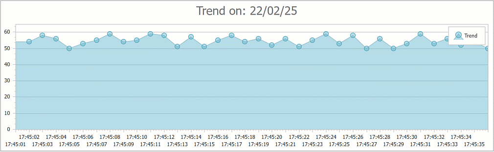

<!-- default badges list -->

<!-- default badges end -->

# Chart for Web Forms - How to Use Callbacks to Update a WebChartControl Dynamically

<!-- run online -->
**[[Run Online]](https://codecentral.devexpress.com/e1070/)**
<!-- run online end -->

This example shows how to use callbacks to update a WebChartControl dynamically.

## Files to Look At

* [Default.aspx](./CS/WebSite/Default.aspx) (VB: [Default.aspx](./VB/WebSite/Default.aspx))
* [Default.aspx.cs](./CS/WebSite/Default.aspx.cs) (VB: [Default.aspx.vb](./VB/WebSite/Default.aspx.vb))

## Documentation

* [Callbacks](https://docs.devexpress.com/AspNet/402559/common-concepts/callbacks)
* [Chart Control](https://docs.devexpress.com/AspNet/8103/components/chart-control?p=netframework)
* [ASPxTimer](https://docs.devexpress.com/AspNet/DevExpress.Web.ASPxTimer)

## More Examples

* [How to: Bind a Web Chart to Data (Runtime Sample)](https://docs.devexpress.com/AspNet/4779/components/chart-control/examples/how-to-bind-a-web-chart-to-data-runtime-sample)
* [How to: Bind an Individual Series to a Data Source (Runtime Sample)](https://docs.devexpress.com/AspNet/120176/components/chart-control/examples/how-to-bind-an-individual-series-to-a-data-source-runtime-sample)